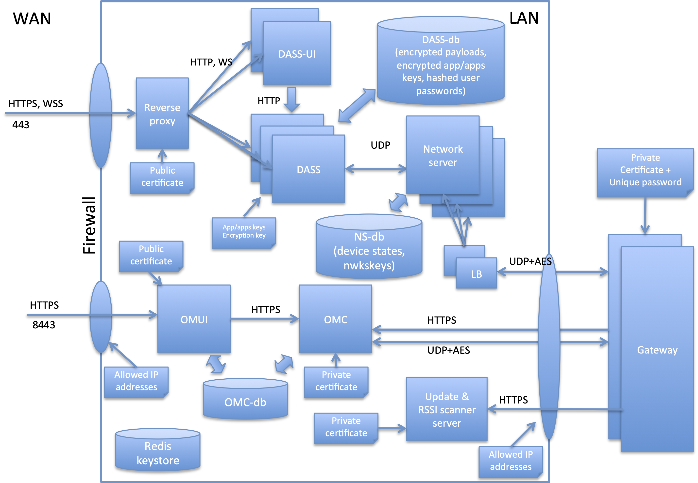
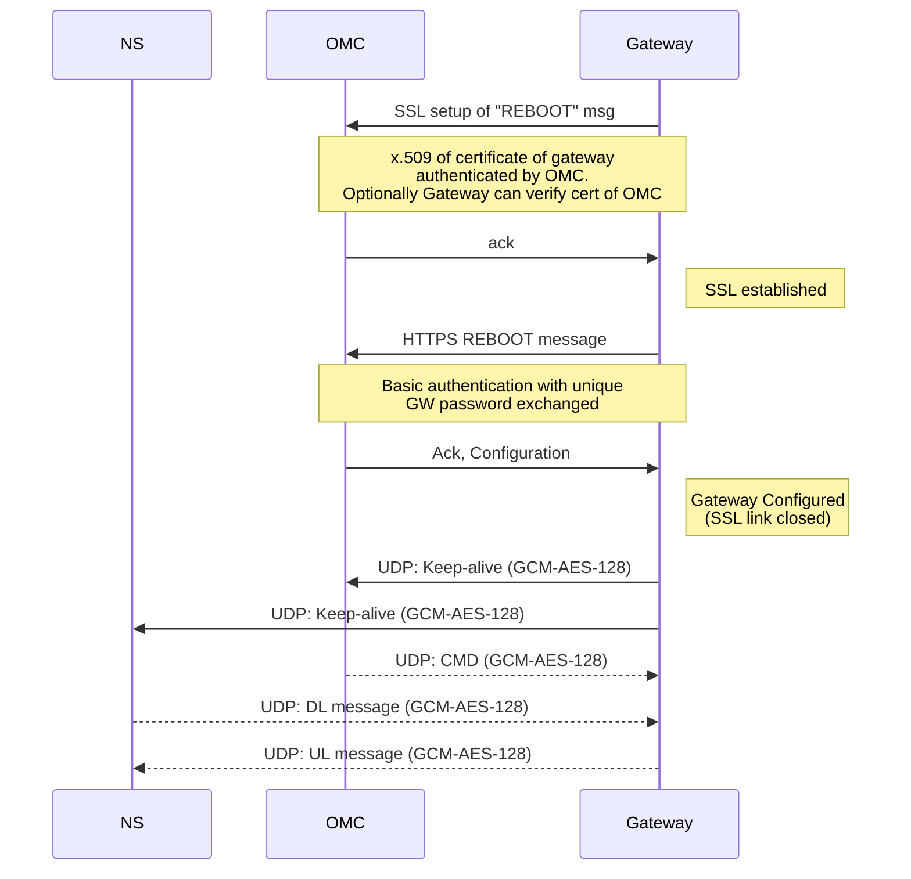
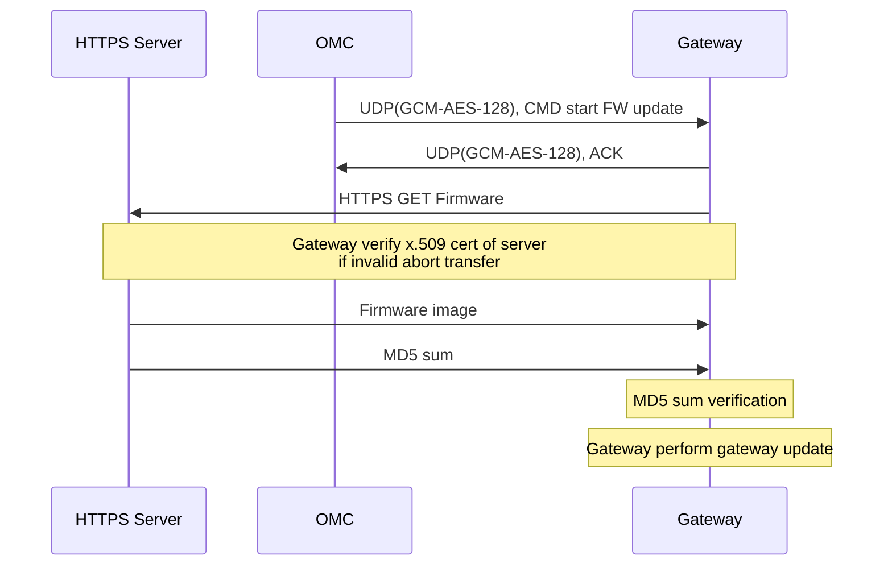
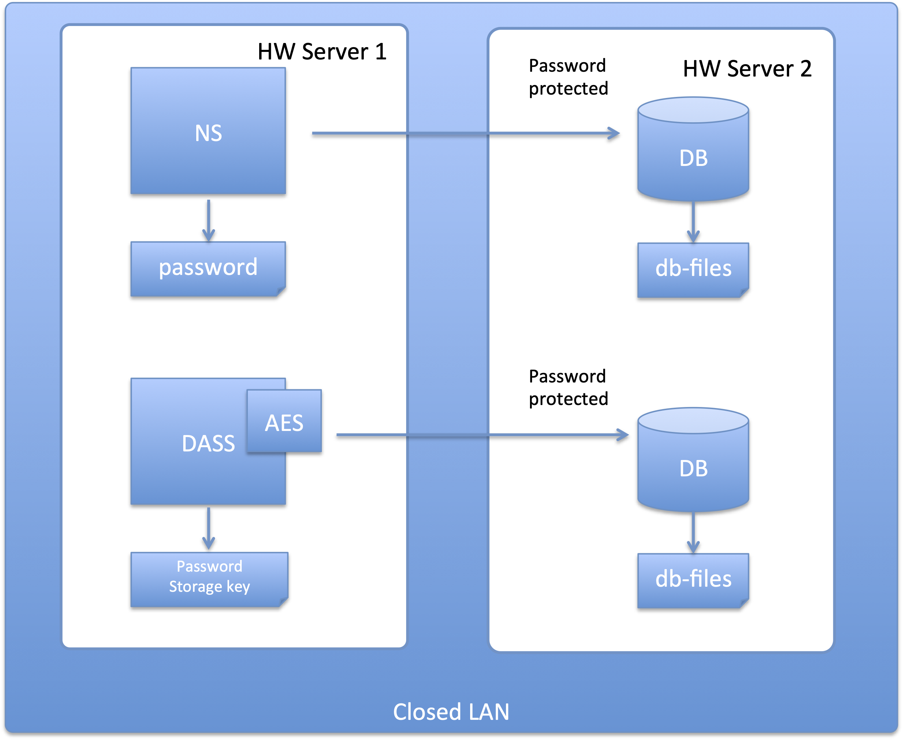

# Overview

This document describes how data is secured at all stages of the OrbiWAN platform. Figure 1 shows an overview (note the figures is not complete, there are minor block and internal interfaces not shown) of all the interface and server entities.

{#fig:orbiwan-sec-arch .center}

The solution has three main interfaces:
* Gateways interface
* DASS and DASS-UI
* OMUI (NST)

The gateways interfaces are an interface that allows gateways to connect to the network server system. The gateways can be located on an extended private LAN that does not allow external (from internet access). However for ease and cost of deployment the gateway interface is designed to allow secure access between gateway and network even when gateways are connected directly via the Internet.

The DASS and DASS-UI interface are HTTPS based interfaces and are typically open to customers directly from the internet.

The OMUI (NST) interface is a private interface that is only accessed by the operator. While the interface is based on secure login, this interface should however not be visible to the general internet and should be accessed only from within the customers own LAN.

The security related to each interface is described in the following sections.

# Gateway interfaces
The gateways connect to the servers through a number of separate interfaces. When the gateway first connect to the network it connect using a HTTPS rest command to the OMC server. The gateway is pre-provisioned with the IP address and/or a DNS alias of the OMC server.

The gateway is further pre-provisioned with an x.509 certificate and associated keys. This certificate/key-pair is shared among all gateways, but is unique and private to the network. If public part of the OMC certificate is pre-installed on the gateway as part of the provisioning, the gateway will only connect to the HTTPS server with known certificate and will verify certificate of OMC as a part of mutual authentication.

The network will only accept the SSL connection from gateways with the valid certificate. This is the first stage for the gateway to be authenticated.

When the gateway with a valid key/certificate has established the SSL link, the gateway sends its unique password to the OMC. The password is unique per gateway and is also installed on the gateway as port of the provisioning.

These passwords are provisioned on the network either manually, or by loading a CSV file with password and gateway IDs.

If the gateway is already provisioned the gateway is accepted and the OMC send back to the gateway a JSON (over the secure SSL connection) object with all additional server details, and in addition 4 AES-128 encryption keys that is used for the subsequent UDP traffic communication.

If the gateway has not yet been provisioned on the network (i.e. the password and has not been registered on the OMC), the gateway will be rejected and will by put in the quarantine list. The quarantine list can always been seen on the NST under gateways  / view blocked gateways. From there the gateway can be manually accepted.

When the gateway has been accepted and has received its configuration message, it start normal operation and will configure its radio according to the network message.
It then start to communicate directly with the network servers (via the load balancers). The gateway typically receives several end-point addresses (IP address and port) for the network server. This is part of the general load-balancing and failover scheme.

All real-time messages exchange between the gateway and the network server – and as well to the OMC – is based on UDP message encrypted using the GCM-AES-128 scheme. 12 bytes are used for the GMAC (Galois Message Authentication Code). This scheme both encrypts and authenticates the message.

Four AES keys are used, two for the link to the OMC and two for the link to the network servers. A field in the message determines which of the two keys are used. This allows to dynamically update the AES keys without interruption to the link.

The GCM-AES-128 encryption scheme is used in both directions and both gateways and network immediately reject any frame that does not pass the authentication.

The gateways continuously send keep-alive messages towards both the network server and the OMC server using the above-mentioned AES scheme. The keep-alive messages are used to “punch holes” in the firewall(s) and NAT to create the return path from the network to the gateway.

As the network cannot directly access a gateway (i.e. a gateway does not have a fixed IP address) and hence always rely on the gateway to connect to the network, after which the network can reach the gateway via the UDP down-stream message send back through the “punched holes”.

The connection scheme is shown in Figure 2.

Gateway has a third interface to a HTTPS server that is used for following purposed.
* Download firmware
* Deposit log files (or any other file) upon request from the OMC (trigger from script)
* Deposit RSSI scanner result files

To ensure integrity of the files being downloaded to the gateway (e.g. the firmware files), the gateway will only connect to the HTTPS server with a know certificate. The public part of the certificate is pre-installed on the gateway as part of the provisioning.

This insures that firmware updates cannot be intercepted and false update be injected. Further, the OMC will upon the request to download the update file in addition send via the UDP command to start the firmware update, a MD5 check sum of the firmware image that is being download via the separate HTTPS server.

The gateway will check the firmware update image again this check sum before starting to the update.

Similarly on the network side, the HTTPS server will only accept connections from gateways with the valid gateway certificate as mentioned above.

Figure 3 shows the message flow (simplified) of the firmware update command.

IP address filtering can further be done on the gateway interface on the entry to the network – provided that the possible gateway IP addresses / address range is well known. This is particularly recommended to avoid DDoS kind of attacks.

This IP filtering is not part of the OrbiWAN solution but is configured on the firewall of the data center.

# OMUI / NST
The OMUI / NST interface is a purely web-based user interface. This interface should be used only by the operator’s own people and should not be available to the general public.
The user interface it self employs standard HTTPS with sign-in credentials to limit access. Users are created with different level of privilege and only few accounts should have full administrative access. Strong password is highly recommended, and in future release strong password will be enforced according to defined policies.

In addition it is strongly recommended to limit the access to the server by applying IP address filtering. I.e. allowing access only from e.g. the operators’ proxy server, such that only people already logged into the normal intranet of the operator can access the NST.

This IP filtering is not part of the OrbiWAN solution but is configured on the firewall of the data center.

# DASS / DASS-UI

The DASS REST interface and the DASS-UI are the interfaces for the general users of the network and need to be available to the wider Internet.

The interface is always using HTTPS, and the allowed ciphering schemes can be configured to be in accordance with the operators’ security policies.

For the DASS REST interface, each request is authenticated using the basic authentication scheme, i.e. once the TSL has established a secure link, the user send the username and password along with each request.
An application can register for receiving push messages whenever a message arrives, or a status is updated. The application can do this by either connect a web-socket (using same basic authentication scheme) or by registered its own REST server, that the DASS can connect to and deliver the message.

When using the PUSH scheme, an application will only rarely (e.g. only for downlink) make REST connections to the gateway, and the password is only used on these “rare” requests.

As the interface use “normal” HTTPS REST messages, “standard” high-level DDoS protection schemes offered by the hosting data center should be able protect this interface against this kind of attacks. This scheme is however outside the scope of the OrbiWAN solution.

The DASS-UI web interface is also allowing connections using HTTPS (HTTP requests are automatically redirected to HTTPS), but unlike the DASS, the DASS-UI use the session sign-in methodology. Once a user connects, he or she will be presented with a login screen. When the user login the username and password is sent encrypted (with TLS) to the server, and the server create session and send back to the browser a session cookie (which is a long random sequence).

The browser will subsequently send back this unique cookie (that is know only by the users browser) for the DASS-UI to identify the user. The username and password is only used to create the session.

As long as the user performs some actions the exchange data between the browser and server, the session is kept alive. After an inactivity period (configurable) the session is destroyed and the user will have to login again.

# Key, payloads and password storage

LoraWan keys need to be stored in the network for the solution to work. The network session keys (nwkskey) are stored in a database associated with the network server. This database can only be accessed from within the same LAN as the network servers are running. Further the database access is protected by password, that is stored in configuration files in the same directory as the servers – i.e. typically different servers than the database itself.

For the application keys (appkey) and application session keys (appskey) and additional security step is used. The appkeys and appskey are stored in the database encrypted using a 128 AES “storage key” that is stored in the configuration file in the same directory as the DASS server.

Only using these keys can the appkeys and appskeys be decrypted. This means that a hacker will have to have full access to the filesystem (i.e. basically full login access) to both the database server and the DASS server in order to be able to steal the keys.

The setup is shown in the figure below.

{#fig:orbiwan-db-access .center}

Access to the database is only possible via the closed local LAN. However should a hacker manage to get access to an accound the can access the local LAN, it is not possible to query the database since there is a password used to protect the access.

Should the hacker mange to get access (i.e. SSH login) to the server itself, only the root user can access the data files. In this case it is possible to dump some data from the database, incl. the current nwkskeys.

However the appkeys and appskey are stored encrypted in the database with a key that is only stored on the other server, and the user would therefor have to access the machine with the DASS to have the decryption keys.

Payload data is stored (temporarily) only in their encrypted form and will require access to both the appskeys and the storage key, in addition to the raw encrypted payload themselves.

Passwords for the accounts on both NST and DASS are stored in their HASH’ed (sha256) form.

